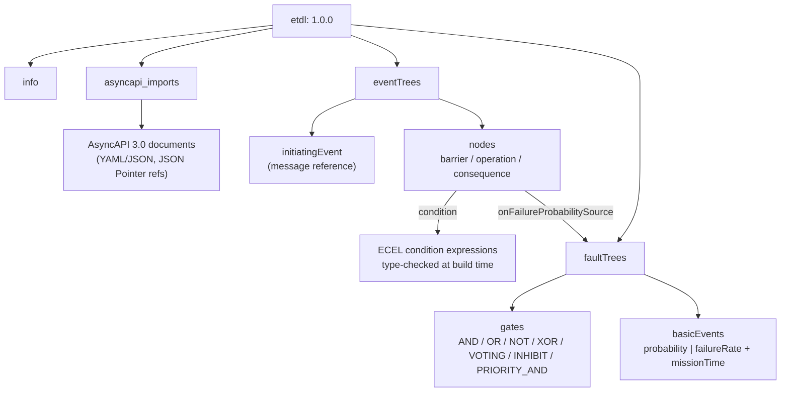
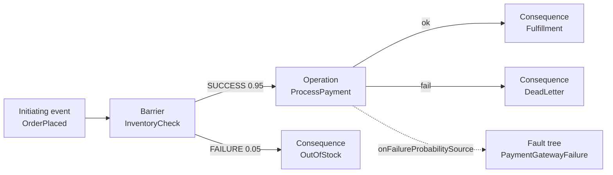
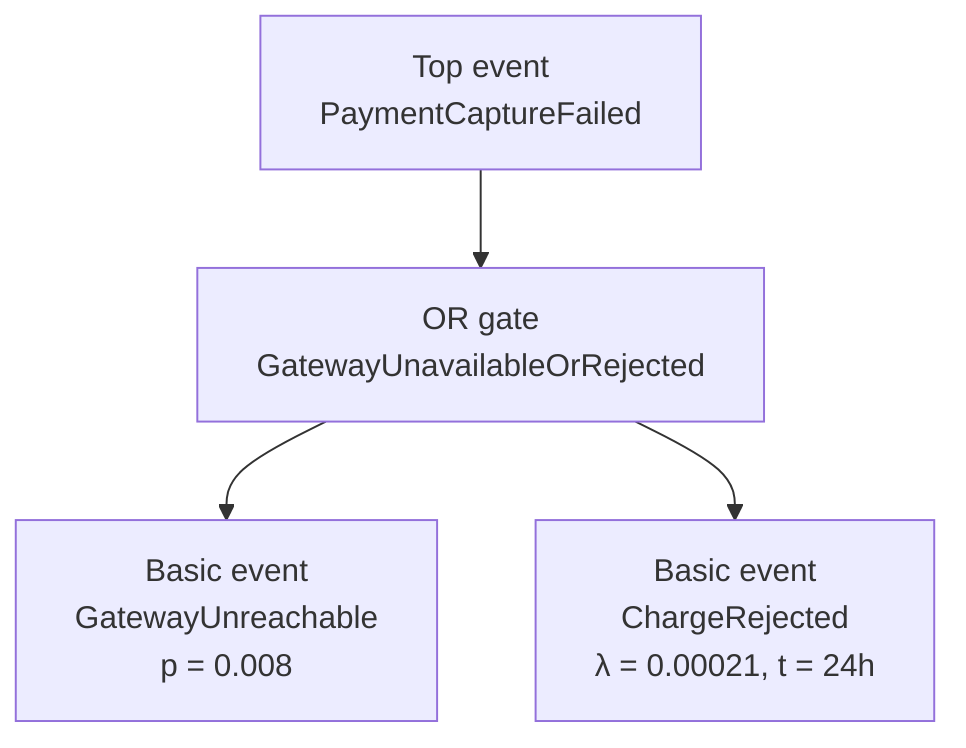

# ETDL Specification — Event Tree Definition Language

**A declarative, design-time domain-specific language (DSL) for reliability-aware, event-driven business processes.**

ETDL combines two internationally standardized reliability-engineering methods — **event tree analysis (ETA, IEC 62502:2010)** and **fault tree analysis (FTA, IEC 61025:2006)** — with **AsyncAPI 3.0** message and channel definitions, into a single machine-checkable document that **compiles directly to service code**.

- **Profile:** IEC 61025:2006 (Fault Tree Analysis) + IEC 62502:2010 (Event Tree Analysis) + AsyncAPI 3.0
- **Version:** 1.0.0
- **Status:** Under Development — NOT YET RELEASED
- **License:** [CC BY 4.0](https://creativecommons.org/licenses/by/4.0/)

> **⚠️ This specification is under development and not yet released.** It is an
> evolving working draft; normative text, schema, validation rules, and examples
> may change before an official release. Do not rely on it as a released,
> stable standard.

[](ETDL-Specification.md)
[](https://github.com/usamassem/etdl)
[](https://crates.io/crates/etdl-cli)

## Quick Links

- [Full Specification](ETDL-Specification.md)
- [Worked Example](examples/order-fulfillment.etdl)
- [ETDL Reliability Supplement 1.0](supplements/reliability/ETDL-Reliability-Supplement.md)
- [ETDL Compiler (Rust)](https://github.com/usamassem/etdl)
- [Crates.io](https://crates.io/crates/etdl-cli)

## ETDL Core vs Supplements vs Implementation

ETDL is a **domain-neutral core** with an extension mechanism for
domain-specific supplements.

- **ETDL Core** — the language itself: event trees, fault trees, operations,
  basic events, probabilities, and compilation semantics. It is domain-neutral
  and never learns reliability-specific ontology, statistics, or AI behavior.
- **ETDL Supplements** — formally identified, versioned domain extensions
  declared via `supplements:` in a document (core §5.1.1). The first one is the
  **ETDL Reliability Supplement 1.0**; future supplements (safety, security,
  diagnostics, performance) can be defined without modifying the core.
- **Reliability Supplement ≠ Reliability implementation** — the supplement
  defines the *representation and semantics* of reliability information;
  Bayesian/Monte-Carlo engines, databases, AI analyzers, and statistical crates
  are separate implementation/provider concerns.

A document that declares no supplements is a fully valid ETDL Core document.
`probability: 0.01` remains valid everywhere it was before.

## What problem does ETDL solve?

Event-driven systems are described by *what* happens (channels, topics, message schemas) but almost never by *why*, *with what probability*, and *in what causal sequence* the system must respond. Reliability decisions — retries, timeouts, backoffs, dead-letter routing, failure probabilities — live scattered inside service code, invisible to architects and unverifiable until production incidents.

ETDL defines a language where **reliability is a design artifact**:

1. **Event Trees (IEC 62502)** model causal sequences: an initiating event passes through barriers, operations, and consequences.
2. **Fault Trees (IEC 61025)** quantify how basic events combine — AND, OR, NOT, XOR, VOTING, INHIBIT, and PRIORITY_AND gates — into a top-event failure probability.
3. **Probability linking** connects operation failures to fault tree top events, so SLAs are exact numbers resolved at build time, not estimates.
4. **AsyncAPI 3.0 integration** type-checks every message reference and ECEL condition against real channel/message schemas.
5. **Compilation** turns the whole model into service-local code — no central orchestration engine, following the *Smart Endpoints, Dumb Pipes* pattern.

## The ETDL document model



### Event tree structure



### Fault tree structure



## Who is this for?

- **Software architects** designing reliable event-driven microservices and wanting reliability reviewed at design time.
- **Reliability engineers** (SRE/RE) who want IEC-method fault/event trees to directly drive software behavior.
- **Platform teams** standardizing on AsyncAPI who need contract enforcement down to runtime behavior.
- **Domain teams** that want their workflows as executable, versionable artifacts instead of prose diagrams.

## Reference implementation

The [ETDL compiler (Rust)](https://github.com/usamassem/etdl) is the reference implementation of this specification:

- `etdl-parser` — document, ECEL, and AsyncAPI parsing with RFC 6901 JSON Pointer resolution
- `etdl-compiler` — semantic validation, fault tree evaluation, code generation (Rust target)
- `etdl-core` — runtime library: BranchMonitor, retry policies, SLA tracking, chaos injection, telemetry
- `etdl-cli` — `etdl compile` and `etdl validate` commands

```bash
cargo install etdl-cli
etdl compile examples/order-fulfillment.etdl --target rust --out-dir ./generated
```

## Repository layout

```
ETDL-Specification.md           The core specification (normative)
schemas/
  etdl.schema.json              Core JSON Schema (Appendix E companion)
supplements/
  reliability/
    ETDL-Reliability-Supplement.md   Reliability Supplement 1.0
    ETDL-Reliability-Schema.json     Reliability supplement schema
    examples/
examples/
  order-fulfillment.etdl        Section 13 worked example (canonical)
  extensions/
    reliability/                Core-only, basic, external, measured,
                                common-cause, observations, migration examples
    hypothetical-future-supplement/  Proof the mechanism is generic
design/
  supplement-extension-design-review.md  Pass 1 design review (read-only)
VERSIONING.md                  Language evolution policy
LICENSE                        CC BY 4.0
```

## Citing

If you use ETDL in research or publications, please cite the specification:

```bibtex
@software{etdl-specification,
  title     = {ETDL Specification — Event Tree Definition Language v1.0.0},
  author    = {the ETDL project},
  year      = {2026},
  url       = {https://github.com/usamassem/etdl-specification},
  license   = {CC-BY-4.0}
}
```

## License

This specification is licensed under the **Creative Commons Attribution 4.0 International (CC BY 4.0)** license — see [LICENSE](LICENSE). The reference compiler and runtime are licensed under Apache 2.0.
